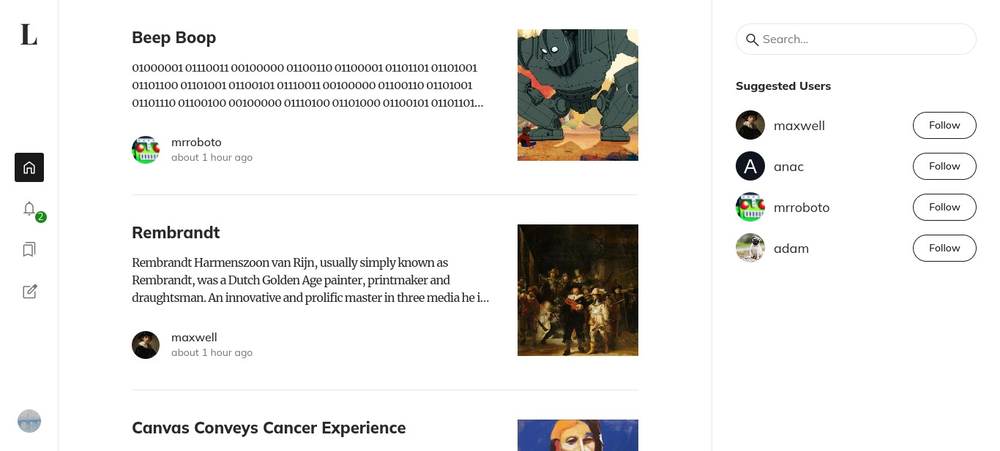

<div id="top" />


<h2 align="center"><a href="https://large-0khw.onrender.com/" target="_blank">Click for Live Demo</a></h2>

**Large** is a React social blogging application that provides functionality offered by sites like Medium.

### Table of Contents

- [About the Project](#about)
  - [Technologies](#technologies)
  - [Features](#features)
  - [Future Goals](#goals)
- [Screenshots](#screenshots)
- [Getting Started](#getting_started)
  - [Prerequisites](#prerequisites)
  - [Installation](#installation)
- [Contributing](#contributing)
- [License](#license)

<p align="right">(<a href="#top">back to top</a>)</p>

## About the Project <a name="about"></a>

### Technologies <a name="technologies"></a>

[![React][react.js]][react-url] 
[![Redux Toolkit][redux]][redux-url] 
[![Sass][sass-lang]][sass-url] 
[![MongoDB][mongodb]][mongodb-url]
[![Node.js][node-js]][node-js-url]

### Features <a name="features"></a>

- Post articles with photos.
- Receive a newsfeed of either people you follow or random users with
- Search through existing posts by title
- Get notifications of followers, comments, and posts from people that you follow
- Like posts and comments created by other users

### Future Goals <a name="goals"></a>

- Add public/private setting to posts or even profiles.
- Add direct messaging
- Ignore users


<p align="right">(<a href="#top">back to top</a>)</p>

## Screenshots <a name="screenshots"></a>




<p align="right">(<a href="#top">back to top</a>)</p>

## Getting Started <a name="getting_started"></a>

### Prerequisites <a name="prerequisites"></a>

First, change directory to the server folder and create an .env with the following fields.
```
MONGO_URI = [your mongo uri here]

CLOUDINARY_NAME = [your cloudinary name]
CLOUDINARY_API_KEY = [your cloudinary api key]
CLOUDINARY_API_SECRET = [your cloudinary api secret]


JWT_ACCESS_SECRET = [jwt access secret]
JWT_REFRESH_SECRET = [jwt refresh secret]

CLIENT_HOST = [url of client host]
```


Next, create an .env file in the root of your project folder, and input your base API url as such:

```
REACT_APP_SERVER_URL = [ex: http://localhost:5000]
REACT_APP_API_URL = [ex: http://localhost:5000/api]
```


### Installation <a name="installation"></a>

Clone the repo and install through your method of choice.

```
$ git clone https://github.com/justinpv98/large.git
$ cd large
$ npm install
```

Run a development server in both the server and client folders.

```
npm start
```

<p align="right">(<a href="#top">back to top</a>)</p>

## Contributing <a name="contributing"></a>

Contributions, issues and feature requests to this little Medium clone are welcome.
<p align="right">(<a href="#top">back to top</a>)</p>

## License <a name="license"></a>

Distributed under the MIT License. See `LICENSE` for more information.

<p align="right">(<a href="#top">back to top</a>)</p>

<!-- LINKS -->

[react.js]: https://img.shields.io/badge/react-20232A?style=for-the-badge&logo=react&logoColor=61DAFB
[react-url]: https://reactjs.org/
[sass-lang]: https://img.shields.io/badge/sass-CC6699?style=for-the-badge&logo=sass&logoColor=white
[sass-url]: https://sass-lang.com/
[redux]: https://img.shields.io/badge/redux-764ABC?style=for-the-badge&logo=redux&logoColor=white
[redux-url]: https://redux.js.org/
[mongodb]: https://img.shields.io/badge/mongoDb-47A248?style=for-the-badge&logo=mongodb&logoColor=white
[mongodb-url]: https://www.mongodb.com/
[node-js]: https://img.shields.io/badge/node.js-339933?style=for-the-badge&logo=node.js&logoColor=white
[node-js-url]: https://nodejs.org/en/docs/
